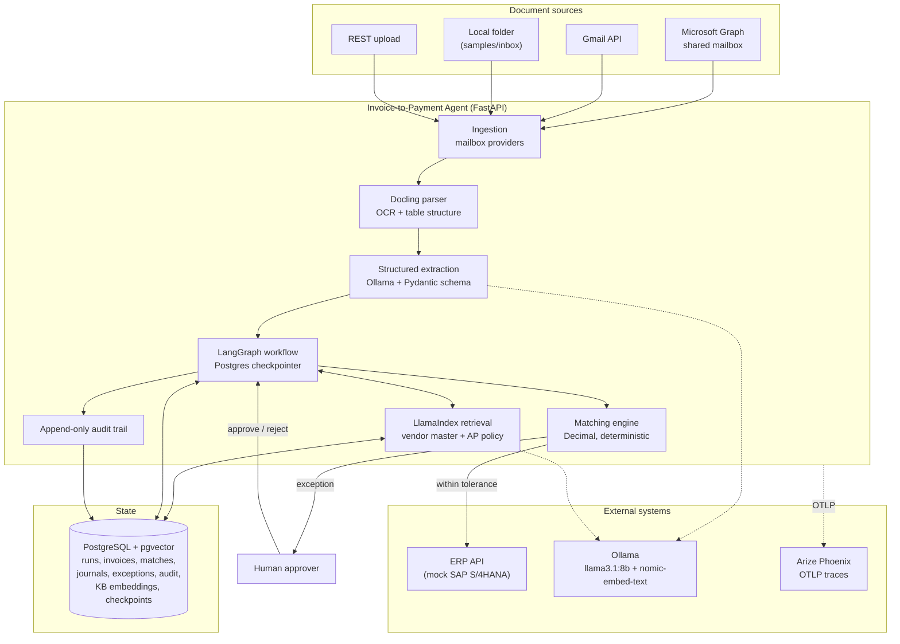
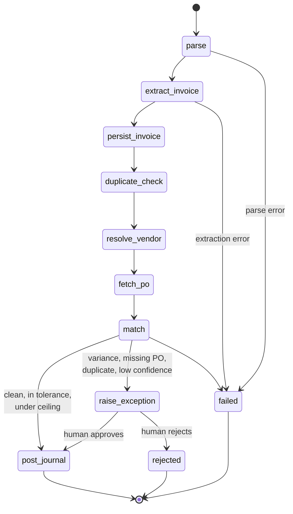
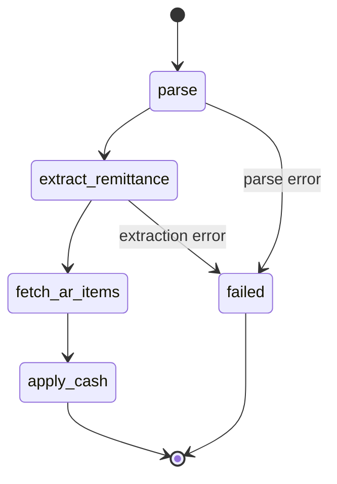

# Agentic Invoice-to-Payment Automation

An AI agent for a finance back office. It reads vendor invoices out of a shared mailbox,
extracts them with Docling, resolves the vendor against ERP master data, runs a 2-way or
3-way match against the purchase order and goods receipt, and posts the payment journal to
the ERP. Anything outside tolerance is parked as an exception for a human approver, and the
run stays checkpointed until a decision arrives. The same workflow runs in mirror for
accounts-receivable remittances, where it applies cash against open AR items.

Every automated decision is written to an append-only audit trail linked back to the source
email message id and the SHA-256 of the source document, so an auditor can reconstruct why a
payment was made without re-running a model.

---

## Table of contents

- [What it does](#what-it-does)
- [Architecture](#architecture)
- [Technology stack](#technology-stack)
- [Quick start with Docker Compose](#quick-start-with-docker-compose)
- [Local development](#local-development)
- [Configuration](#configuration)
- [API reference](#api-reference)
- [Matching rules and tolerances](#matching-rules-and-tolerances)
- [Exception handling](#exception-handling)
- [Audit trail](#audit-trail)
- [Evaluation](#evaluation)
- [Testing](#testing)
- [Project layout](#project-layout)
- [Design decisions](#design-decisions)
- [Known limitations](#known-limitations)

---

## What it does

A vendor emails an invoice PDF to the AP shared mailbox. From there:

1. **Ingest.** The mailbox poller pulls the message and its attachments. Microsoft Graph,
   Gmail, and a local filesystem provider all implement the same interface, so the rest of
   the pipeline does not know or care where a document came from.
2. **Parse.** Docling converts the PDF, image, HTML, or Office document to Markdown with
   OCR and table structure enabled, so a scanned invoice — the majority of real AP volume —
   travels the same path as a native PDF.
3. **Extract.** A local Ollama model fills a strict Pydantic schema: header fields, vendor
   identifiers, totals, and line items. Every field carries its own confidence score.
4. **Persist and de-duplicate.** The extraction is stored, then checked against prior runs
   on vendor, invoice number, and gross amount.
5. **Resolve the vendor.** Fuzzy name matching against ERP vendor master, backed by a
   pgvector index of vendor records and their known aliases.
6. **Fetch the PO and goods receipts** from the ERP for the referenced purchase order.
7. **Match.** Deterministic Decimal arithmetic decides 2-way or 3-way, line by line,
   against configured tolerances.
8. **Post or escalate.** A clean match inside tolerance and under the auto-post ceiling
   posts the payment journal straight through. Anything else raises a typed exception, the
   graph interrupts, and the run waits for a human decision.

The accounts-receivable mirror is shorter: parse, extract the remittance advice, fetch open
AR items, and apply cash against the matched invoices.

## Architecture



### The accounts-payable graph



`raise_exception` issues a LangGraph `interrupt`. The run is checkpointed to Postgres at
that point, so the process can restart, be redeployed, or sit for three days waiting for an
approver, and resume exactly where it stopped.

### The accounts-receivable graph



## Technology stack

Every component named in the assignment brief, and where it lives in the code:

| Component | Technology | Where |
|---|---|---|
| Email ingestion | Microsoft Graph API / Gmail API | `src/invoice_agent/ingestion/mailbox/` — `graph.py`, `gmail.py`, `local.py` behind one `MailboxClient` interface |
| Document processing | Docling | `src/invoice_agent/ingestion/parser.py`, OCR and table structure on, PyMuPDF text-layer fallback |
| Vector database | PostgreSQL + PGVector | `src/invoice_agent/rag/index.py` via `PGVectorStore`; extension created in `alembic/versions/0001_initial_schema.py` |
| RAG framework | LlamaIndex | `src/invoice_agent/rag/` — two indexes, hybrid dense + text search |
| Agent orchestration | LangGraph | `src/invoice_agent/agents/graph.py` and `agents/nodes/` |
| LLM provider | Ollama | `src/invoice_agent/llm/provider.py` — `langchain-ollama` for the graph, `llama-index-llms-ollama` for retrieval |
| ERP integration | SAP-style mock API | `mock_erp/` (server), `src/invoice_agent/erp/client.py` (client) |
| Observability | Arize Phoenix | `src/invoice_agent/core/observability.py` — OpenInference instrumentors over OTLP |
| Evaluation | RAGAs + extraction accuracy metrics | `evaluation/` |
| Deployment | Docker and Docker Compose | `Dockerfile`, `docker-compose.yml` |

## Quick start with Docker Compose

Requirements: Docker with Compose v2, roughly 12 GB of free disk for the images and the
Ollama models, and 8 GB of RAM available to Docker.

```bash
git clone https://github.com/<your-account>/invoice-to-payment-agent.git
cd invoice-to-payment-agent

cp .env.example .env          # defaults work as-is for a local run
docker compose up -d --build
```

The first start pulls `llama3.1:8b` (about 4.9 GB) and `nomic-embed-text` (about 275 MB).
The `api` service waits for that pull to finish, for Postgres to accept connections, and for
the Alembic migration to complete, so the stack is genuinely ready when the API reports
healthy rather than merely started.

Watch it come up:

```bash
docker compose logs -f api
curl -s http://localhost:8000/api/v1/health | jq
```

| Service | URL | What it is |
|---|---|---|
| API | http://localhost:8000 | The agent |
| Swagger UI | http://localhost:8000/docs | Interactive OpenAPI documentation |
| ReDoc | http://localhost:8000/redoc | Reference-style API documentation |
| OpenAPI JSON | http://localhost:8000/openapi.json | Machine-readable specification |
| Mock ERP | http://localhost:8081/docs | Purchase orders, goods receipts, journals, AR |
| Phoenix | http://localhost:6006 | LLM traces, latency, token counts |
| Postgres | localhost:5432 | `invoice` / `invoice` / `invoice_agent` |
| Ollama | http://localhost:11434 | Local model server |

### Run an invoice through it

Seven sample invoices ship in `samples/inbox`, each with a `.meta.json` describing the email
it arrived on. They cover a clean three-way match, a clean two-way match, a price variance,
a goods-receipt shortfall, an unknown vendor with no PO, a duplicate resubmission, and an
invoice above the auto-post ceiling.

```bash
# Poll the local mailbox provider and process everything in it
curl -s -X POST http://localhost:8000/api/v1/mailbox/poll \
     -H 'Content-Type: application/json' \
     -d '{"kind": "accounts_payable"}' | jq

# Or upload a single invoice directly
curl -s -X POST http://localhost:8000/api/v1/ingest-invoice \
     -F 'file=@samples/inbox/INV-2026-0873_northwind.pdf' \
     -F 'sender=billing@northwind.example' \
     -F 'subject=Invoice INV-2026-0873' | jq
```

A clean invoice comes back with `straight_through: true` and a journal document number. One
that breaches tolerance comes back with `awaiting_approval` populated and an exception in
the queue:

```bash
curl -s 'http://localhost:8000/api/v1/exceptions?status=open' | jq

curl -s -X POST http://localhost:8000/api/v1/exceptions/<case_id>/decision \
     -H 'Content-Type: application/json' \
     -d '{"decision": "approve", "approved_by": "ap.manager@example.com",
          "note": "Price increase confirmed against contract addendum 4"}' | jq
```

Then read the trail:

```bash
curl -s 'http://localhost:8000/api/v1/audit-log?run_id=<run_id>' | jq '.events[] | {sequence, action, summary}'
curl -s http://localhost:8000/api/v1/metrics/straight-through | jq
```

### Shutting down

```bash
docker compose down          # keep the volumes
docker compose down -v       # also drop Postgres, the models, and stored documents
```

## Local development

Requirements: Python 3.12, Poetry, a reachable PostgreSQL with the `vector` extension
available, and a running Ollama.

```bash
poetry install
cp .env.example .env

# Schema and pgvector extension
poetry run alembic upgrade head

# Models
ollama pull llama3.1:8b
ollama pull nomic-embed-text

# Mock ERP in one shell
poetry run uvicorn mock_erp.main:app --port 8081

# The agent in another
poetry run uvicorn invoice_agent.main:app --reload --port 8000
```

`poetry install` puts the `invoice_agent` and `mock_erp` packages on the path. If you run
modules without Poetry's environment — for example calling the evaluation harness with a
bare interpreter — set `PYTHONPATH=src:.` first, because only pytest and Alembic are
configured to add `src` themselves.

## Configuration

Configuration is Pydantic Settings, read from the environment and from `.env`. Settings are
grouped, and each group has its own prefix: `INVOICE_AGENT_DB_`, `INVOICE_AGENT_LLM_`,
`INVOICE_AGENT_MAILBOX_`, `INVOICE_AGENT_ERP_`, `INVOICE_AGENT_MATCH_`, and
`INVOICE_AGENT_OBS_`. Credentials are typed `SecretStr` so they do not leak into logs or
tracebacks.

`.env.example` documents every variable with its default. The ones worth knowing:

| Variable | Default | Why you would change it |
|---|---|---|
| `INVOICE_AGENT_AUTH_ENABLED` | `false` | Turn on before exposing the service. Then send `X-API-Key` or a bearer token. |
| `INVOICE_AGENT_MAILBOX_PROVIDER` | `local` | `graph` or `gmail` for a real shared mailbox. |
| `INVOICE_AGENT_LLM_MODEL` | `llama3.1:8b` | A larger model raises extraction accuracy at the cost of latency. |
| `INVOICE_AGENT_LLM_EMBEDDING_DIM` | `768` | Must match the embedding model. Changing one without the other breaks the pgvector tables. |
| `INVOICE_AGENT_MATCH_AUTO_POST_CEILING` | `25000.00` | The segregation-of-duties limit above which nothing posts unattended. |
| `INVOICE_AGENT_MATCH_MIN_EXTRACTION_CONFIDENCE` | `0.75` | Below this the invoice goes to a human regardless of how well it matches. |

### Connecting a real mailbox

**Microsoft Graph** — register an application, grant it the `Mail.Read` *application*
permission with admin consent, then set `INVOICE_AGENT_MAILBOX_PROVIDER=graph` along with
the tenant id, client id, client secret, and the user principal name of the shared mailbox.

**Gmail** — create OAuth client credentials, download the JSON to
`credentials/gmail_credentials.json`, set `INVOICE_AGENT_MAILBOX_PROVIDER=gmail`, and
complete the consent flow once; the refresh token is cached to
`credentials/gmail_token.json`.

## API reference

Full interactive documentation is at `/docs`; the OpenAPI specification is at
`/openapi.json` and a generated copy is committed at [`docs/openapi.json`](docs/openapi.json).

The five endpoints required by the brief:

| Method | Path | Purpose |
|---|---|---|
| `POST` | `/api/v1/ingest-invoice` | Ingest a vendor invoice and run the AP workflow |
| `POST` | `/api/v1/match-po` | Match an invoice against its PO and goods receipts |
| `POST` | `/api/v1/post-payment-journal` | Post the payment journal for a matched invoice |
| `GET` | `/api/v1/audit-log` | Append-only decision trail |
| `GET` | `/api/v1/health` | Liveness and per-dependency health |

And the rest of the surface:

| Method | Path | Purpose |
|---|---|---|
| `POST` | `/api/v1/ingest-remittance` | Ingest a customer remittance and run the AR workflow |
| `POST` | `/api/v1/mailbox/poll` | Poll the configured mailbox and process every attachment |
| `GET` | `/api/v1/runs/{run_id}` | Current state of one workflow run |
| `GET` | `/api/v1/journals/{run_id}` | The payment journal posted for a run |
| `GET` | `/api/v1/exceptions` | The human approval queue |
| `GET` | `/api/v1/exceptions/{case_id}` | One exception with its variance detail and policy guidance |
| `POST` | `/api/v1/exceptions/{case_id}/decision` | Approve or reject, and resume the workflow |
| `GET` | `/api/v1/metrics/straight-through` | STP rate derived from run rows |

### Health is per-dependency

`/api/v1/health` checks Postgres, Ollama, the ERP, and Phoenix separately and reports each
one. Postgres being down means the service cannot function, so the overall status is `down`.
Ollama or the ERP being unreachable degrades the service — no new invoice can be processed —
but the audit trail and the approval queue stay readable, so the overall status is
`degraded` rather than `down`. A load balancer and a human on call want different answers to
"is it up", and this distinguishes them.

### Testing tolerances without ingesting a document

`POST /api/v1/match-po` accepts an inline invoice payload, so you can probe the tolerance
behaviour directly. No model is called; this is pure arithmetic.

```bash
curl -s -X POST http://localhost:8000/api/v1/match-po \
  -H 'Content-Type: application/json' \
  -d '{
        "po_number": "4500001234",
        "invoice": {
          "invoice_number": "INV-TEST-1",
          "vendor_name": "Contoso Industrial Supplies GmbH",
          "currency": "EUR",
          "total_amount": "12495.00",
          "line_items": [
            {"description": "Hex bolt M12x60 A2", "quantity": "500",
             "unit_price": "1.49", "line_total": "745.00"}
          ]
        }
      }' | jq '.report.outcome, .report.exceptions'
```

## Matching rules and tolerances

The model extracts; this module decides. Every verdict is `Decimal` arithmetic against
configured tolerances, which means a match is reproducible and can be explained to an
auditor without re-running an LLM.

| Rule | Default | Note |
|---|---|---|
| Unit price | 2 % | Percentage tolerance on the unit price itself |
| Unit price, absolute | 5.00 | Applied to the **extended line value** — price delta multiplied by invoiced quantity |
| Quantity | exact | No tolerance for goods |
| Invoice gross total | 1 % or 10.00 | Whichever the variance satisfies |
| Tax | 1.00 absolute | Absorbs rounding differences |
| Auto-post ceiling | 25,000.00 | Above this nothing posts unattended, even on a perfect match |
| Minimum extraction confidence | 0.75 | Below this a human looks at it regardless of the match |
| Vendor name similarity | 88 | Fuzzy threshold against vendor master and aliases |

The absolute price tolerance deliberately governs the extended line value rather than the
unit price. A flat 5.00 per-unit floor would wave through a 34 % overcharge on a 14.50 part,
and would wave through hundreds of euros once multiplied across a large quantity. The cash
at risk is price delta times quantity, so that is what the absolute limit is applied to.

**Line pairing** falls back in three steps: PO line number, then material code, then fuzzy
description similarity. Real invoices frequently carry neither of the first two, and
hard-joining on them manufactures exceptions that a human then has to clear by hand.

**Match type** is chosen from the PO, not guessed. A PO flagged as requiring goods receipt
gets a three-way match against received quantities; a service PO flagged otherwise gets a
two-way match. An invoice with no resolvable PO is `non_po` and always goes to a human.

## Exception handling

Fourteen typed exceptions, each with a severity, a human-readable summary, a suggested
action, and the variance detail that produced it:

`price_variance`, `quantity_variance`, `total_variance`, `tax_variance`, `missing_po`,
`missing_goods_receipt`, `duplicate_invoice`, `unknown_vendor`, `low_confidence_extraction`,
`line_not_on_po`, `over_auto_post_ceiling`, `currency_mismatch`, `unapplied_remittance`,
`erp_posting_failed`.

When an exception is raised the workflow retrieves the relevant AP policy text from the
LlamaIndex knowledge base and attaches it to the case, so the approver sees the rule that
was applied rather than only the number that broke it.

Duplicate detection keys on vendor, invoice number, and gross amount. Invoice *date* is
deliberately excluded, because vendors re-issue the same invoice with a fresh print date and
including it would let a genuine duplicate through.

## Audit trail

Every run writes an ordered, append-only sequence of events: `email_received`,
`document_parsed`, `fields_extracted`, `duplicate_checked`, `vendor_resolved`, `po_fetched`,
`goods_receipt_fetched`, `match_evaluated`, `exception_raised`, `human_decision`,
`journal_posted`, `cash_applied`, `run_failed`.

Each event carries the acting node, a summary, a structured payload, the elapsed
milliseconds, and — critically — the source email message id and the SHA-256 of the source
document. That hash is what ties a posted payment back to the exact bytes that justified it.

Filtered by `run_id` the events come back in workflow sequence, which is the order an auditor
reads them. Unfiltered they come back newest first, which is the order an operator reads
them.

## Evaluation

The harness scores extraction against a hand-written answer key in
`evaluation/datasets/ground_truth.json` covering all seven sample documents.

```bash
# Parsing and extraction only. Needs Docling and Ollama, no database.
poetry run python -m evaluation.run_evaluation --mode extraction

# The whole pipeline through the running API. Needs the compose stack up.
poetry run python -m evaluation.run_evaluation --mode e2e
```

Reported metrics:

- **Extraction field accuracy** — per-field exact match against ground truth, and a
  per-field breakdown so a systematically weak field is visible rather than averaged away.
- **Line item accuracy** — description, quantity, and unit price agreement per line.
- **Mean extraction confidence** — the model's own scored confidence, useful mainly as a
  check that confidence tracks correctness.
- **Match rate** — share of invoices whose match outcome equals the expected outcome.
- **Exception detection rate** — share of documents that should have raised an exception
  and did. This is the number that matters most: a missed exception is an incorrect payment.
- **Straight-through rate** — share of runs that reached a posted journal with no human
  touch, plus STP *decision accuracy*, which is whether the automation posted the invoices
  it should have posted and stopped on the ones it should have stopped on.

The most recent run is written to `evaluation/results/evaluation_report.md` and
`evaluation_report.json`.

**Which metrics populate in which mode.** `--mode extraction` exercises parsing and field
extraction only, so it reports extraction accuracy, line item accuracy and confidence; the
match rate, exception detection rate and straight-through rate read 0% there because no
matching ran, not because matching failed. Those three need `--mode e2e` against the running
compose stack, which drives each document through the real API and reads back the run,
the match outcome and the posted journal.

The committed report predates the prompt fix that taught the model to read a line labelled
"Net amount" as `subtotal`, which is why `subtotal` sits at 28.6% there while the other twelve
fields score 100%. Re-running `make evaluate` regenerates it with that fix applied.

The committed report is an `extraction` run, produced on an 8 GB M2 with Docling pinned to
CPU (`DOCLING_DEVICE=cpu`) — on that machine Docling's vision models and a resident
`llama3.1:8b` do not fit in the Metal budget together. The parse and extract timings in the
report reflect that constraint and are not representative of server hardware.

## Testing

```bash
poetry run pytest              # unit and contract tests
poetry run pytest --cov        # with coverage
poetry run ruff check .        # lint
poetry run mypy src mock_erp   # types
```

The suite covers the matching engine's tolerance boundaries, confidence scoring, vendor
resolution, journal construction and balancing, the remittance path, the mock ERP's own
contract, and the API's request and response shapes. It needs no database, no model and no
network: an autouse fixture stubs the knowledge base so unit tests never reach pgvector.

A test marked `integration` opts out of that stub and runs against the real vector store, so
it needs the compose stack up. The marker is registered and honoured; no test currently
carries it.

## Project layout

```
src/invoice_agent/
  agents/          LangGraph workflow: graph.py, state.py, prompts.py, nodes/
  api/v1/          FastAPI routers - ingest, match, journal, audit, exceptions, health, metrics
  core/            config, structured logging, domain errors, Phoenix tracing
  db/              SQLModel tables, repository, async session
  erp/             ERP HTTP client with retries
  ingestion/       Docling parser, confidence scoring, mailbox providers
  llm/             Ollama chat and embedding providers, structured extraction with repair
  matching/        Deterministic 2-way / 3-way match engine
  rag/             LlamaIndex over pgvector - vendor master and AP policy
  schemas/         Pydantic contracts - invoice, ERP, matching, API, shared enums
  services/        Workflow service: run lifecycle, mailbox polling
mock_erp/          SAP-flavoured ERP: POs, goods receipts, vendors, journals, AR items
evaluation/        Ground truth, metrics, harness, generated reports
alembic/           Schema migrations
samples/inbox/     Seven sample invoices plus a remittance, with email metadata
scripts/           Sample-document generator, presentation-deck builder
tests/             Unit and contract tests
docs/              architecture.md, openapi.json, the solution deck
Dockerfile         Multi-stage build, Docling model cache warmed into the image
docker-compose.yml Seven services, ordered by health conditions
Makefile           make check, make up, make evaluate, make deck
.env.example       Every setting with its default, documented
```

Further reading: [docs/architecture.md](docs/architecture.md) covers component boundaries,
the data model, the straight-through and exception sequences, failure modes, and the
security posture.

## Design decisions

**The LLM extracts; deterministic code decides.** Nothing about whether to pay money is left
to a language model. The model turns a document into structured fields; a Decimal arithmetic
engine compares those fields against the PO and the tolerance configuration. That makes
every posting decision reproducible and explainable, and it means tightening a tolerance is a
configuration change rather than prompt engineering.

**Human-in-the-loop through checkpointed interrupts, not polling.** The approval pause is a
LangGraph `interrupt` over a Postgres checkpointer. The run's full state persists at the
interrupt, so the service can be restarted or redeployed while an invoice waits for an
approver, and the resumed run continues from exactly that node.

**Two vector indexes rather than one.** Vendor master and AP policy live in separate pgvector
tables because they answer different questions. Blended into a single top-k, policy prose
consistently outranks the vendor row the query actually needed.

**The audit trail is derived from what happened, not asserted alongside it.** The STP metric
is computed from run rows rather than counted into a separate tally, so it cannot drift away
from what the audit events say actually occurred.

**Degraded is distinct from down.** Health reports each dependency separately, because losing
Ollama stops new processing but leaves the approval queue and audit trail fully readable.

**Tracing is never fatal.** Phoenix instrumentation is wrapped so that an unreachable
collector logs a warning and the service runs on. Observability is not the product.

## Known limitations

- **The ERP is a mock.** `mock_erp` mirrors the shape of the SAP S/4HANA OData surface —
  purchase orders, goods receipts, vendor master, journal entries, AR items — and holds
  state in process, reseeding on startup so evaluation runs stay reproducible. A real
  integration would swap `erp/client.py` for an OData or BAPI client; the rest of the
  pipeline is unaffected because it talks to the client's interface, not the ERP.
- **Extraction quality tracks the local model.** `llama3.1:8b` was chosen so the whole stack
  runs on one machine with no external API calls, which is the right default for finance
  documents. A larger model measurably improves line-item extraction on dense invoices.
- **Mailbox polling is request-triggered.** `POST /mailbox/poll` drives a poll. A production
  deployment would run this on a scheduler or move to Graph change notifications rather than
  polling on an interval.
- **Currency conversion is not implemented.** A currency mismatch between invoice and PO is
  detected and raised as an exception rather than converted at a daily rate.

## License

MIT. See [LICENSE](LICENSE).
