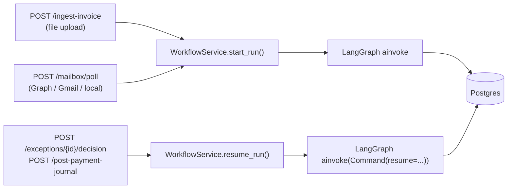
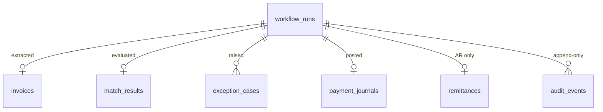
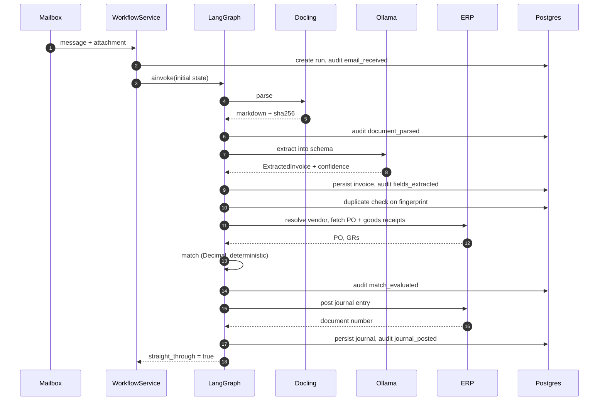
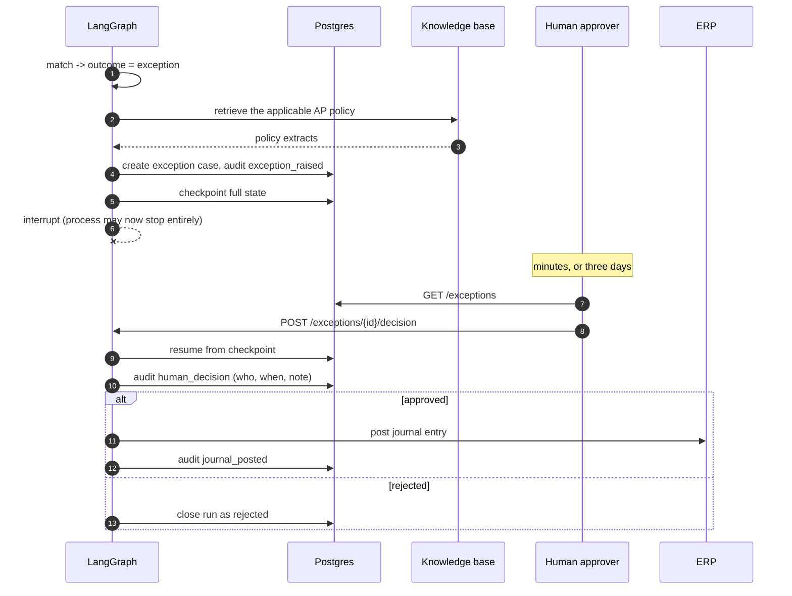

# Architecture

Companion to the [README](../README.md). The README explains how to run the system; this
document explains how it is put together and why, at the level a reviewer or a maintainer
needs.

## Contents

- [Component responsibilities](#component-responsibilities)
- [Request paths](#request-paths)
- [Data model](#data-model)
- [The straight-through path](#the-straight-through-path)
- [The exception path](#the-exception-path)
- [Where state lives](#where-state-lives)
- [Failure modes](#failure-modes)
- [Security posture](#security-posture)

## Component responsibilities

| Module | Owns | Deliberately does not own |
|---|---|---|
| `ingestion/mailbox/` | Fetching messages and attachments, marking them processed | Anything about invoice content |
| `ingestion/parser.py` | Turning bytes into Markdown, with OCR and a fallback | Interpreting what the Markdown means |
| `llm/structured.py` | Coercing model output into a validated Pydantic model, with repair and retry | Deciding whether the values are acceptable |
| `ingestion/confidence.py` | Scoring how much to trust an extraction, per field and overall | Acting on that score |
| `matching/engine.py` | The 2-way / 3-way verdict, purely arithmetic | Calling any model, or touching the database |
| `agents/nodes/` | Sequencing: what happens next, and what gets audited | Business rules — those live in the matching engine |
| `agents/graph.py` | Graph topology and checkpointing | Node internals |
| `erp/client.py` | HTTP to the ERP, retries, error translation | Retry policy for the workflow as a whole |
| `db/repository.py` | Every read and write, including audit append | Session lifetime — that belongs to the caller |
| `services/workflow.py` | Run lifecycle, and the single entry point the API and the poller share | HTTP concerns |
| `api/v1/` | HTTP contracts, status codes, validation | Business logic of any kind |

The separation that matters most is the last row of the middle column: the matching engine is
the only place a payment decision is made, it is pure, and it is fully unit-tested. Everything
around it is plumbing.

## Request paths

Three entry points converge on one service method:

`start_run` and `resume_run` are the only two ways the graph is ever driven. An API handler
never touches LangGraph directly, which is what lets the mailbox poller and the REST upload
share identical behaviour rather than merely similar behaviour.

## Data model

Seven application tables, all UUID-keyed, all hanging off `workflow_runs`:

| Table | Holds | Notable constraint |
|---|---|---|
| `workflow_runs` | One row per document processed: source email metadata, document SHA-256, status, whether it went straight through | Composite index on `(status, created_at)` — the operator queue query |
| `invoices` | The extracted fields, line items as JSONB, per-field confidence, the raw Markdown | Index on `fingerprint` and on `(vendor_name, invoice_number)` — duplicate detection |
| `match_results` | Match type, outcome, header variances, per-line matches, the exception list, the human-readable reasons | Outcome indexed for reporting |
| `exception_cases` | One row per exception raised, with severity, summary, suggested action, and resolution | Composite index on `(status, created_at)` — the approval queue |
| `payment_journals` | The posted journal: ERP document number, fiscal year, lines, approver | `UNIQUE (run_id)` — the database itself refuses a second journal for a run |
| `remittances` | AR side: advice lines, what was applied, residual | `applied` indexed |
| `audit_events` | Every decision, sequenced | Composite index on `(run_id, sequence)` — the auditor's read |

Two more table groups are managed by libraries rather than by the migration:

- `kb_vendor_master` and `kb_ap_policy` — LlamaIndex `PGVectorStore` tables holding the
  embeddings, created on first use.
- LangGraph checkpoint tables — created by `AsyncPostgresSaver.setup()` at startup.

The `UNIQUE (run_id)` on `payment_journals` is worth calling out. Duplicate prevention is
already enforced in the workflow, and the ERP rejects a repeated reference, but the constraint
means that even a bug in the graph cannot produce two payment journals for one invoice. The
guarantee lives in the database, not in the code that happens to be running.

## The straight-through path

## The exception path

The interrupt is the important part. The run is not held in memory waiting; it is written to
the checkpointer and the call returns. A restart, a redeploy, or a crash between the exception
and the decision costs nothing, because resuming reads the state back from Postgres and
continues at the same node.

## Where state lives

| State | Lives in | Survives a restart |
|---|---|---|
| Run status, extraction, match, journal, exceptions, audit | Postgres application tables | Yes |
| In-flight graph state at an interrupt | LangGraph Postgres checkpointer | Yes |
| Vendor and policy embeddings | pgvector via LlamaIndex | Yes |
| Stored source documents | `INVOICE_AGENT_DOCUMENT_STORE`, a mounted volume | Yes |
| ERP records | Mock ERP, in process | **No** — reseeds on startup, deliberately, so evaluation runs are reproducible |
| Traces | Phoenix volume | Yes |

The checkpointer falls back to an in-memory saver if Postgres is unreachable, so unit tests
and a database-less smoke run still exercise the graph. That fallback logs a warning and is
never silent, because a production deployment running on the memory saver would lose parked
approvals on restart.

## Failure modes

| What fails | What happens | Why it was designed that way |
|---|---|---|
| Docling cannot parse a file | Falls back to the PDF text layer via PyMuPDF; if that yields nothing readable, the run fails with `DocumentParseError` | A layout model failing on one odd file should not stop the queue, but silently returning empty text would be worse than failing |
| Model returns malformed JSON | Repaired and retried up to `max_extraction_retries`, then the run fails | A parse failure is recoverable; a plausible-looking wrong number is not |
| Extraction confidence below threshold | `low_confidence_extraction`, routed to a human | Low confidence and a clean match is exactly the dangerous combination |
| PO not found in the ERP | `missing_po`, match type `non_po`, routed to a human | Non-PO invoices are legitimate; they just never post unattended |
| ERP unreachable | Retried with backoff; then `erp_posting_failed` with the run preserved | The invoice is already extracted and matched — none of that work should be lost |
| ERP rejects the journal | `erp_posting_failed`, exception raised, journal row records the error | The ERP's rejection is data an approver needs, not an error to swallow |
| Postgres unreachable | Health reports `down`; requests fail loudly | There is no correct behaviour without the audit trail |
| Phoenix unreachable | Warning, service continues | Observability is not the product |

## Security posture

- **Authentication** is bearer token or `X-API-Key`, compared with `secrets.compare_digest`.
  It is off by default so a local run needs no headers, and `INVOICE_AGENT_AUTH_ENABLED=true`
  turns it on. Every router except the root and the docs carries the guard.
- **Secrets** are `SecretStr` throughout the configuration, so a credential cannot be printed
  into a log line or a traceback by accident.
- **Uploads** are validated against a suffix allowlist and capped at 25 MB, streamed to a
  temporary file rather than read into memory.
- **The ERP client** sends its API key as a header and never logs the request body.
- **Documents are stored by run id** under a path the configuration controls, and the SHA-256
  of every stored document is recorded on the run and on each audit event, so tampering with a
  stored file after the fact is detectable.

Two gaps a production deployment would need to close: the API token is a single shared
secret rather than per-caller identity, and there is no tenant scoping — the service assumes
one company code per deployment.
